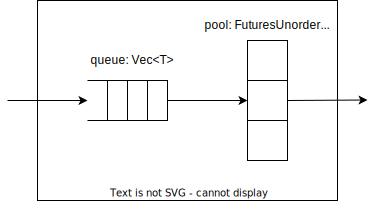

= Taskpool

A task pool runs up to N tasks concurrently.
Tasks in excess of N will be queued.
Input tasks via the input channel.
Receive results via the output channel.

== Alternative to StreamExt::buffer_unordered

This is an alternative approach to https://docs.rs/futures/latest/futures/stream/trait.StreamExt.html#method.buffer_unordered[StreamExt::buffer_unordered].
